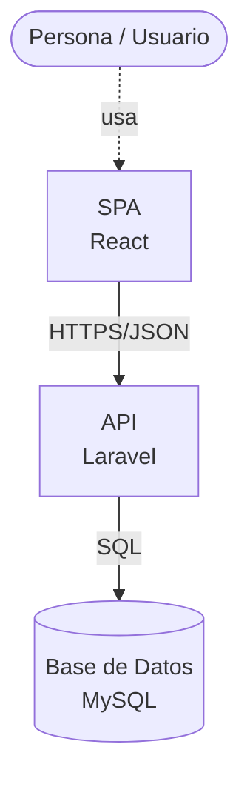

# Arquitectura de TaskFlow

> Este archivo es parte de la Tarea 2 del curso (se asigna al cierre de la Sesión 2, se entrega en la Sesión 4).

## Diagrama

**Diagrama de Contenedores (Nivel 2 - C4)**

- **Persona (Usuario)** `usa` la **SPA (React)**.
- **SPA (React)** se comunica con la **API (Laravel)** mediante `HTTPS/JSON`.
- **API (Laravel)** lee/escribe en la **Base de Datos (MySQL)** mediante `SQL`.

## Decisiones de arquitectura

- **Arquitectura desacoplada (API-first):** Utilizamos Laravel puramente como API para separar completamente las responsabilidades entre el frontend y el backend. Esto permite que la interfaz de React se desarrolle de forma independiente y facilita que múltiples clientes consuman los mismos datos en el futuro.
- **Capas del backend:** La capa de presentación (rutas y controladores) recibe las peticiones HTTP y retorna JSON. La lógica de negocio reside en los modelos, mientras que el acceso a los datos se maneja a través de Eloquent ORM y migraciones.
